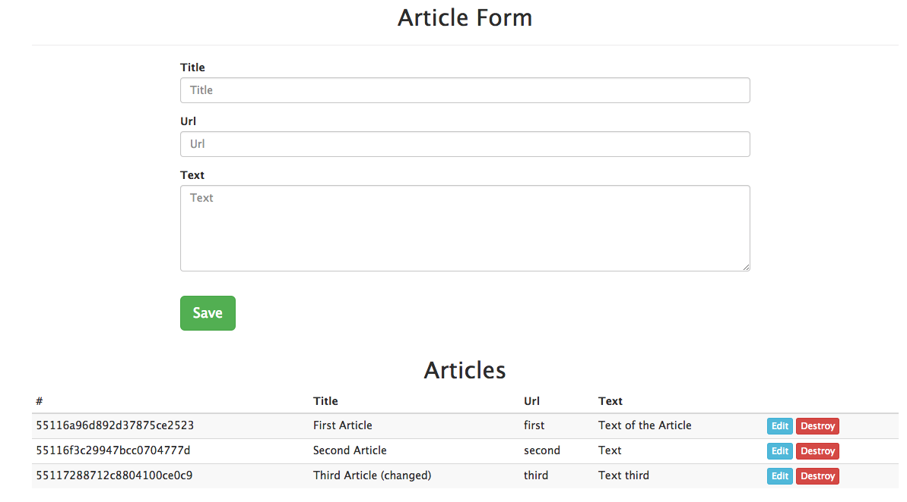

# Simple REST Service

To start the project you should follow these steps:

* `npm install` installs necessary packages
* `bower intall` installs frontend dependencies (bootstrap, Angular and so on)
* start **mongodb**
* `gulp` for serving assets and starting server

### Testing

* `npm install -g karma-cli`
* `karma start test/karma.conf.js`

